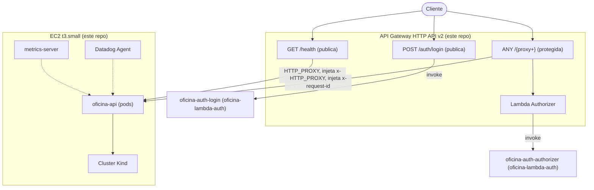

# oficina-infra-k8s

Infraestrutura Kubernetes (via Terraform) do Tech Challenge Fase 3 (POSTECH). Parte do split de repositórios descrito em [ADR-0005](https://github.com/Williamnasci/oficina-api/blob/main/docs/adr/0005-split-de-repositorios.md), no repositório principal [`oficina-api`](https://github.com/Williamnasci/oficina-api).

## Propósito

Provisiona, via Terraform, os recursos AWS que dão suporte ao cluster Kubernetes e ao roteamento externo:

- **EC2 `t3.small`** hospedando um cluster **Kind** (Kubernetes-in-Docker) com IP público — não Amazon EKS, por decisão de custo registrada em [ADR-0003](https://github.com/Williamnasci/oficina-api/blob/main/docs/adr/0003-cluster-kubernetes-local.md). O ADR documenta duas correções: primeiro, Kind precisou sair do notebook (API Gateway precisa de um alvo de rede alcançável); depois, `t3.micro` (Free Tier) se mostrou insuficiente na prática sob carga real, daí `t3.small` (fora do Free Tier, custo baixo).
- **API Gateway (HTTP API v2)**, com a estratégia de roteamento híbrida (rotas explícitas para auth/health + proxy protegido por Lambda Authorizer para a aplicação) definida em [ADR-0004](https://github.com/Williamnasci/oficina-api/blob/main/docs/adr/0004-api-gateway-roteamento.md).

O cluster em si (manifests de Deployment, Service, HPA da aplicação) continua no repositório [`oficina-api`](https://github.com/Williamnasci/oficina-api) — este repositório provisiona a infraestrutura onde o cluster roda, não o que roda dentro dele.

## Tecnologias

- Terraform
- AWS (EC2, API Gateway HTTP API v2, IAM)
- Kind (Kubernetes-in-Docker)
- GitHub Actions (CI/CD)

## Status

✅ Aplicado e validado ponta a ponta contra a conta AWS real: EC2 `t3.small` (Ubuntu 24.04) rodando Kind, kubeconfig externo publicado no Secrets Manager (`oficina/k8s/kubeconfig`), `metrics-server` instalado no bootstrap (HPA validado escalando de 2 para 6 réplicas sob carga real), aplicação principal implantada e respondendo via NodePort. Acesso operacional via **SSM Session Manager** (sem SSH/chave).

**API Gateway (HTTP API v2) implementado e testado** — roteamento híbrido do [ADR-0004](https://github.com/Williamnasci/oficina-api/blob/main/docs/adr/0004-api-gateway-roteamento.md): `POST /auth/login` e `GET /health` públicas, `ANY /{proxy+}` protegida por Lambda Authorizer (`oficina-lambda-auth`). As duas funções Lambda são referenciadas por `data source` (lookup por nome), sem acoplar os states dos dois repositórios. O `integration_uri` das rotas de proxy usa o IP público da EC2 diretamente do mesmo state, então continua correto automaticamente após recriar a instância.

A instância original (`t3.micro`, Free Tier) ficou não-responsiva sob carga real (control-plane do Kind + réplicas da aplicação), mesmo após reboot — ver a correção registrada em [ADR-0003](https://github.com/Williamnasci/oficina-api/blob/main/docs/adr/0003-cluster-kubernetes-local.md). `t3.small` resolveu.

> **Nota de custo:** a EC2 é destruída (`terraform destroy -target=aws_instance.cluster_host`) entre sessões de trabalho para não gerar gasto continuo numa conta pessoal Free Tier. **Qualquer merge em `main` deste repositório** — inclusive mudanças só de documentação — dispara `terraform apply` automático no CI/CD, que recria a EC2 se ela estiver destruída (o recurso continua declarado no `.tf`, só ausente do state). Não é um bug: é o comportamento correto e esperado de um `apply` declarativo. Na prática, isso significa destruir a EC2 como o **último passo** de uma sessão de trabalho, depois de qualquer merge planejado neste repositório — nunca antes.

## Deploy e execução

### Pré-requisitos (uma vez só)

1. Bucket S3 de backend remoto (compartilhado com `oficina-infra-database`) — ver instruções no `oficina-api` (`docs/phase-3-plan.md`).
2. Secrets do repositório GitHub:
   - `AWS_ACCESS_KEY_ID` / `AWS_SECRET_ACCESS_KEY` — credenciais IAM (não root) com permissão para EC2, IAM (role/instance profile) e Secrets Manager.
   - `OFICINA_API_REPO_TOKEN` (opcional) — Personal Access Token com escopo `repo` sobre `Williamnasci/oficina-api`, usado pela pipeline para publicar automaticamente o `KUBE_CONFIG` gerado como secret naquele repositório. Sem isso, copie manualmente (comando abaixo).

### Local

```bash
cp terraform.tfvars.example terraform.tfvars
terraform init
terraform plan
terraform apply

# depois do apply (leva alguns minutos até o user_data terminar):
aws secretsmanager get-secret-value --secret-id oficina/k8s/kubeconfig --query SecretString --output text > kubeconfig
gh secret set KUBE_CONFIG --repo Williamnasci/oficina-api < kubeconfig
```

### CI/CD

`.github/workflows/terraform.yml`: `terraform plan` em todo PR; `terraform apply` automático ao mergear em `main`, seguido de push automático do `KUBE_CONFIG` para o `oficina-api` (se `OFICINA_API_REPO_TOKEN` estiver configurado).

`terraform apply` retorna assim que a EC2 fica "running" (segundos), mas o bootstrap real do cluster (`user_data.sh.tpl`) leva minutos. Antes de buscar o `KUBE_CONFIG`, a pipeline espera o secret `oficina/k8s/kubeconfig` ser atualizado com um `LastChangedDate` posterior ao `LaunchTime` da instância atual — evita publicar no `oficina-api` um kubeconfig obsoleto (de uma instância anterior) ou o job falhar tentando ler um secret que ainda não foi escrito. Timeout de 10 minutos.

### Acesso operacional (debug)

```bash
aws ssm start-session --target $(terraform output -raw instance_id)
```

## Diagrama

Visão focal deste repositório (rede e roteamento — o diagrama completo da solução está no [Diagrama de Componentes](https://github.com/Williamnasci/oficina-api/blob/main/docs/architecture-components.md) do `oficina-api`):



O API Gateway injeta `$context.requestId` como header `x-request-id` nas duas integrações HTTP_PROXY (`app_health`, `app_proxy`) — a aplicação (`nestjs-pino`, no `oficina-api`) usa esse header como correlation ID em vez de gerar um novo, então o mesmo ID aparece nos access logs do Gateway (CloudWatch) e nos logs da aplicação (Datadog).
